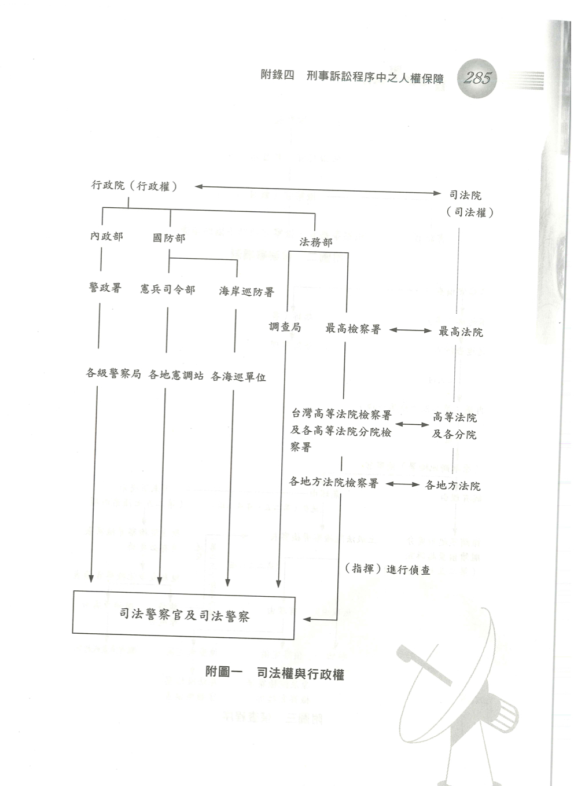
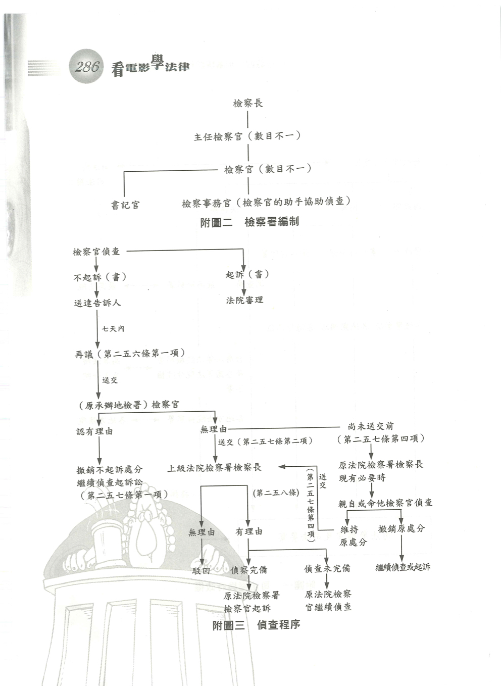
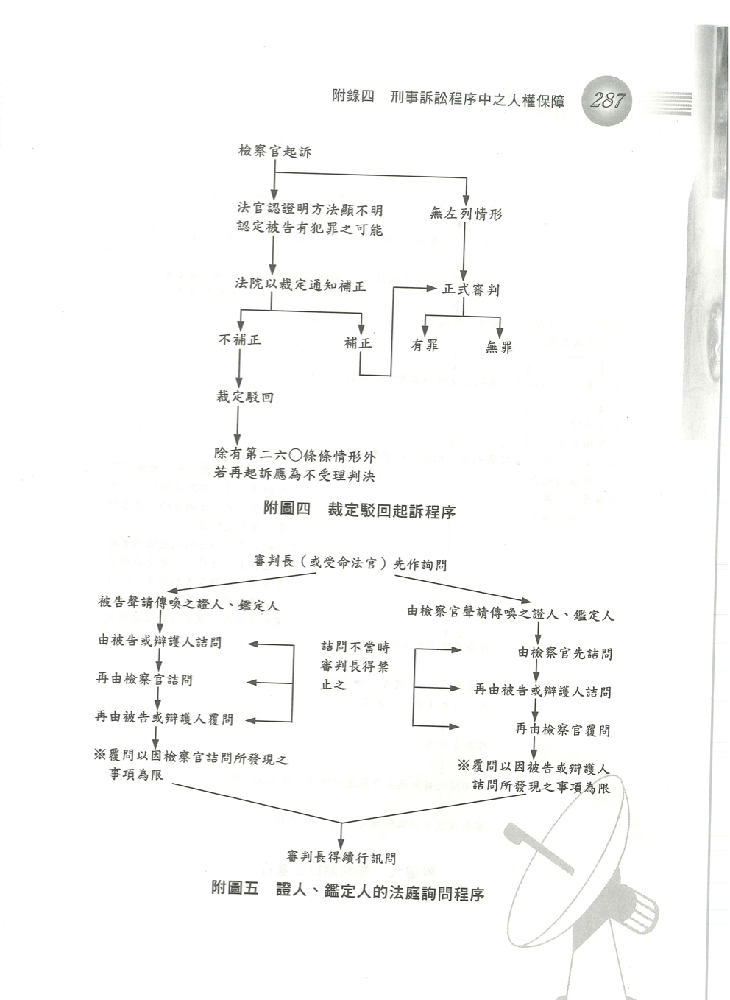
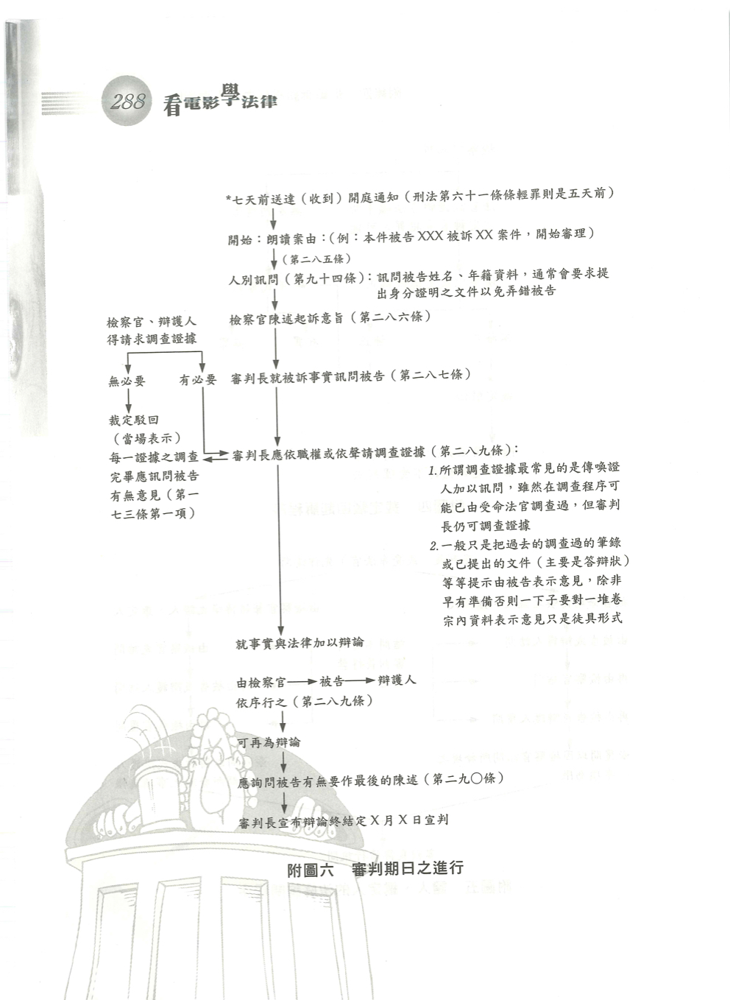
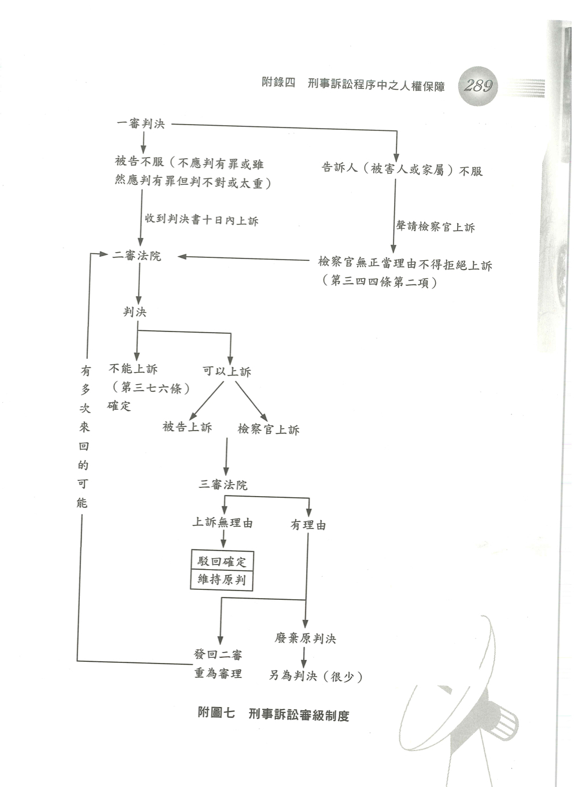

# 附錄四　刑事訴訟程序中之人權保障

> 以下所引條文如係刑事訴訟法不另註明

### 刑事程序

所謂「刑事」程序相對於「民事」程序或「行政」程序而言，刑事程序指的是確定刑事責任的程序；更清楚的說：「刑」指的是「刑法」（包含各種特別刑法，如貪污治罪條例等）的「刑」，換言之，就是犯什麼罪，因此刑事程序就是確定有沒有犯罪、什麼罪名（包含刑法及各種特別刑法），及受什麼刑罰的程序。

### 偵查、檢察官

所謂「程序」，指的是刑事犯罪的追訴過程，其主要又可分為「偵查」與「審判」；所謂「偵查」指的是犯罪的追查，而犯罪偵查的主角則是檢察官（第二二八條第一項）。

### 檢察署

檢察官是配屬在「檢察署」之內，各檢察署的地位與其業務上所指揮的司法警察單位關係如附圖一。而各檢察署的內部編制大略如附圖二，檢察署內檢察官的工作分派方式不一，有依偵查犯罪類型劃分，例如：經濟犯罪組、智慧財產權犯罪組、兒童及婦女犯罪組、肅貪專組等，也有依工作性質劃分偵查組、公訴組、執行組等。

### 起訴、不起訴、緩起訴、再議

檢察官偵查犯罪最後作成決定可能是「起訴」（第二五一條第一項）或是「不起訴」（第二五二條至第二五四條），依新修正的刑事訴訟法還有緩起訴（第二五三條之一），在起訴後，檢察官就變成「審判」程序中的類似民事訴訟中「原告」的角色；若檢察官作出不起訴處分，如果沒有被害人（告訴人）則案件就終結，但假使當初是被害人提出告訴，告訴人可以在收到不起訴書或緩起訴處分後七日內提出再議（第二五六條第一項），若確實有理由意即不起訴或緩起訴是不妥當的，則必須繼續偵查或逕予起訴，如果緩起訴被撤銷（第二五三條之三），檢察官也同樣應繼續偵查或予以起訴。相關流程如附圖三。

依九十一年修正的刑事訴訟法，偵查之結果除起訴或不起訴以外尚有緩起訴，其目的係針對原本應起訴，但基於各種情形（刑法第五十七條）及公益考量，可以不予起訴，但又恐怕直接不起訴不妥當，因以設有「緩起訴」制度，其性質類似「緩刑」，即在緩起訴後在一定期間內不再犯一定刑度以上之罪或受刑之宣告，且有履行緩起訴所一併宣告之條件，如必要的治療、賠償等（第二五三條之二），則等於沒有起訴一樣，反之則應撤銷緩起訴。在撤銷緩起訴的情形，相對應的，被告得提出再議。

### 偵查不公開、閱卷

在整個偵查程序中有所謂「偵查不公開」（第二四五條第一項），所以雖然被告可以請律師在場並陳述意見（第二四五條第二項）但因不公開，所以對筆錄（訊問紀錄）不能抄錄（其實是影印）卷宗（簡稱閱卷），不像審判時係公開審理，所以可以閱卷（第三十三條）。

### 裁定駁回起訴

法院的正式審判（包含準備程序及審判期日）以前就檢察官提出的起訴書如果可以看出對所認定之犯罪事實的證明方法，明顯不足認定被告有成立犯罪之可能時，應裁定命檢察官補正，逾期不補正，可以裁定駁回（第一六一條第二項、第一六一條第三項）。這是為了保障人權且避免檢察官明明證據不足卻執意起訴，法院仍需進行所有程序而設，其流程如附圖四。

### 準備程序

正式審判（開庭）前，得先訊問被告、證人、鑑定人等此程序通稱為「準備程序」。

### 合議庭

如果在地方法院一般案件，負責審判程序與準備程序的通常是同一個法官，但是地方法院的重大案件或上訴二審後的高等法院案件，係由三個法官組合議庭。

### 受命法官、審判長

案件在調查程序由其中一個法官進行，稱之為「受命法官」，而審判程序時，則由坐在中間的「審判長」主持，而受命法官則坐在審判長的右邊。

### 調查證據

調查證據一般包含對被告的訊問、對證人、鑑定人的訊問（第一六六條以下）、證物的調查（第一六四條至第一六五條）、鑑定（第一九七條以下）及勘驗（第二一二條以下），其中有關證人與鑑定人之詢問程序如圖五。

### 職權調查證據

法院在審判中係「聽訟」的角色，所以調查證據應是由雙方（被告及檢察官）「聲請」之，但為「公平正義之維護」或「對被告利益有重大關係事項」例外的法院才「依職權」主動調查證據（第一六三條第二項），這是希望改變過去檢察官不積極舉證被告有罪，使得法官不得不一再「依職權」調查被告不利的證據，而有「球員兼裁判」之譏，因此把「依職權」調查列為例外，而所以不是一下子完全禁止法官依職權調查證據主要是考慮到目前許多被告未聘請律師為自己主張調查有利之證據而造成顯失公平的情形，所以設有例外的規定。

### 審判期日

審判期日應通知被告、辯護人、檢察官、被害人（或其家屬）到庭（第二七一條第一項、第二項），重大案件（第三一條第一項）沒有辯護人在場，不得審判（第二八四條），被告經合法傳喚卻不到庭，除非是要判無罪、諭知免刑、僅應科拘役、罰金（不會判處有期徒刑以上），否則不得逕行審判程序（第二八一條）而作成判決。審判期日的程序如附圖六。

### 上訴

法院（更清楚的講是獨任法官或合議庭的法官們）宣判後，如有不服可以在十天內聲明上訴，一般案件可以上訴三審，性質上較輕案件（第三七六條）則只能上訴二審，能上訴三審就有可能在二審、三審間上上下下。可參考附圖七。

### 發回

案件在二審、三審間來來回回的主要原因是一審、二審都是事實審（認定事實及適用法律），但三審是法律審（依二審所認定之事實適用法律），如果三審認為二審對事實沒有查清楚（包含未查明或者雖有查出，但可能相互矛盾），則因為三審原則上不能自行認定事實，所以只好把判決撤銷後發回（退回）二審重新審理，因此要改善這種情形所造成的案件積延正本清源之道，應該是提升偵查及一審的辦案品質，因為案件離事情發生時間愈遠，事實愈不易查明（證人死亡、物證滅失等……）。

### 科學辦案

要提升偵查及一審乃至二審的辦案品質應該要著重「科學辦案」，也就是「讓證據說話」，絕對不可以有羈人取供的想法，這也就是法律規定「犯罪事實應依證據認定之」（第一五四條第一項）、「被告自白、非出於強暴、脅迫、利誘、詐欺、違法羈押或其他不正方法，且與事實相符者，（始）得為證據」（第一五六條第一項），且縱使非違法取得之自白，亦「不得作為有罪判決唯一證據」（第一五六條第二項），尤其不得僅因「被告拒絕陳述或保持緘默」而推斷其罪行（第一五六條第三項），而這些規定都是希望犯罪認定要由證據認定之。

---

要確保證據可靠最好的方法就一切依照法律來走，而刑事程序（刑事訴訟法）在此最重視的是「人權的保障」而不是「如何破案」，因為一心破案的結果不僅可能侵害人權而對破案「走錯路」，而造成無辜者冤抑而真凶逍遙法外。

以下介紹刑事程序上最重要的部分，即對人的強制與對物的強制。

### 對人強制與對物強制

所謂對人的強制包括被告的傳喚與拘提（第七十一條至第九十三條之一、被告的訊問（第九十四條至第一○○條之三）、被告之羈押（第一○一條至第一二一條），而所謂對物之強制即指搜索及扣押（第一二二條至第一五三條）以下分別說明之。

## 一、被告之傳喚及拘提

### 傳喚、傳票

傳喚被告應用傳票（第七十一條第一項），傳票在偵查中由檢察官簽名，起訴後由受命法官或審判長簽名（第七十一條第四項）。 受合法傳喚，無正當理由不到場，得拘提之（第七十五條）。

### 通知書

司法警察官或司法警察得使用通知書，通知犯罪嫌疑人到場詢問（第七十一條之一） 受合法「通知」無正當理由不到場，（法警察官或司法警察），得報請檢察官核發拘票（第七十一條之一）。

### 逕行拘提

有重大犯罪嫌疑而且有下列情形之一者，得不經傳喚逕行拘提：（第七十六條）。 

1. 無一定住居所。 
2. 逃亡或有事實足認有逃亡之虞。 
3. 有事實足認有湮滅、偽造、變造證據或勾串共犯或證人之虞者。
4. 所犯為死刑、無期徒刑或最輕本刑為五年以上有期徒刑之罪者。

拘提要用拘票（第七十七條第一項），拘票應備二聯，執行拘提時應以一聯交被告或家屬（第七十九條），使其瞭解案由、拘提之理由、應解送之處所（第七十七條第二項）。

### 通緝、通緝書

被告逃亡或藏匿，得通緝之（第八十四條），通緝應用通緝書（第八十五條第一項），通緝書在偵查中應由檢察長簽名，起訴後由法院院長簽名（第八十五條第三項）。 通緝後，得拘提或逕行逮捕（第八十七條第一項、第二項）。

### 現行犯

現行犯，不問何人得逕行逮捕之（第八十八條第一項）。 現行犯指：
1. 犯罪在實施中或實施後即時發現者（第八十八條第二項）。
2. 被追呼為犯人者（第八十八條第三項第一款）。 
3. 因持有凶器，贓物或其他物件或於身體、衣服等等露有犯罪痕跡顯可疑為犯罪人者（第八十八條第三項第二款）。

### 緊急拘提

緊急而有下列情形，必要時無拘票仍可拘提被告（第八十八條之一）：

1. 因現行犯之供述，且有事實足認共犯嫌疑重大者。
2. 在執行或在押中之脫逃者。
3. 有事實足認犯罪嫌疑重大，經被盤查而逃逸者。但所犯顯係最重本刑一年以下有期徒刑，拘役或專科罰金之罪者，不在此限。
4. 所犯為死刑、無期徒刑或最輕本刑為五年以上有期徒刑之罪，嫌疑重大，有事實足認有逃亡之虞者。 

緊急拘提若事後檢察官不核發拘票，應即釋放（第八十八條之一第二項）。緊急拘提時應告知本人及家屬，得選任辯護人到場（第八十八條之一第四項）。

### 羈押

被告或犯罪嫌疑人因拘提或逮捕應立即訊問（第九十三條第一項），檢察官訊問後認有羈押必要時應自拘提或逮捕起二十四小時內向法院聲請羈押（第九十三條第二項），否則即應釋放（第九十三條第三項），但仍可要求具保，或限制住所。 法院受理羈押聲請應即時訊問（第九十三條第五項）。 所謂二十四小時要扣除部分時間（第九十三條之一）如夜間未能訊問之時間、交通時間、等辯護人之時間（但不得逾四小時）等等。

## 二、被告之訊問

### 分別訊問

訊問被告應先確定其年籍資料，若有錯誤應即釋放（第九十四條）。

其次應告知其權利（第九十五條）包含：

1. 犯罪嫌疑及所犯所有罪名，罪名經告知後，認為應變更者應再告知。
2. 得保持緘默，無須違背自己之意思而為陳述。
3. 得選任辯護人。
4. 得請求調查有利（自己的）證據。

### 對質

訊問時應分別（隔離）訊問，且有必要時得命對質（第九十七條第一項），被告請求對質時，原則上不得拒絕（第九十七條第二項）。

訊問被告應全程連續錄音，必要時應全程錄影（第一○○條之一第一項），筆錄與錄音或錄影不符，不符部分不得作為證據（第一○○條之一第二項）。

### 夜間訊問

原則上不得為夜間詢問，例外情形如下（第一○○條之三）：

1. 經受詢問人明示同意。
2. 在夜間拘提或逮捕到場而查驗其人有無錯誤。
3. 經檢察官或法官許可者。
4. 有急迫情形者。

## 三、被告之羈押

### 羈押、一般性羈押

（一般性羈押）犯罪嫌疑重大且有下列情形，非予羈押，顯難進行追訴、審判或執行者，法官於訊問後得命羈押（第一○一條第一項）：

1. 逃亡或有事實足認有逃亡之虞者。
2. 有事實足認有湮滅、偽造、變造證據或勾串共犯或證人之虞者。
3. 所犯為死刑、無期徒刑、最輕本刑為五年以上有期徒刑之罪者。

法官為訊問時，檢察官得到場陳述聲請羈押之理由及提出必要之證據（第一○一條第二項）。 

羈押之原因應告知被告及辯護人使之有說明之機會（第一○一條第三項）。

### 預防性羈押

（預防性羈押）觸犯縱火罪、妨害自由罪、竊盜罪、搶奪罪等等嫌疑重大，而又有事實足認有反覆實施同一犯罪之虞，而認有羈押必要時，亦得羈押之（第一○一條之一第一項）。

### 交保、責付、 限制住居

有第一○一條及第一○一條之一各款情形而無羈押必要得逕命具保、責付、限制住居（第一○一條之二）。

### 押票

羈押應用押票（第一○二條第一項），並由法官簽名（第一○二條第四項），押票並應分別交付檢察官，看守所、辯護人、被告及被告指定之親友（第一○三條第二項）。

### 接見

羈押中被告得自備飲食及日用必需物品，並與外人接見、通信、受授書籍及及其它物件（第一○五條第二項），但法院得依檢察官聲請或依職權命禁止或扣押之（第一○五條第三項），檢察官並得先為必要處分。

### 撤銷羈押

羈押原因消滅時，應撤銷羈押將被告釋放（第一○七條第一項），被告、辯護人得隨時聲請法院撤銷羈押（第一○七條第二項），檢察官聲請撤銷羈押時，法院應撤銷羈押（第一○七條第四項），偵查中撤銷羈押，應徵詢檢察官意見（第一○七條第五項）。

羈押被告受不起訴或緩起訴處分，視為撤銷羈押（第二五九條第一項）。

### 羈押期間

被告偵查中不得逾二個月，審判中每一審不得逾三個月（第一○八條第一項），但得裁定延長，偵查中以一次、二個月為限，審判中每次不得逾二個月，一定罪責以下並有次數限制（第一○八條第五項）。

羈押期滿未經起訴或審判者，視為撤銷羈押，應予釋放（第一○八條第七項）。

### 停止羈押

羈押中得隨時具保請求停止羈押（第一一○條第一項）。 

下列情形，經具保停止羈押，不得駁回（第一一四條）：

1. 所犯最重為三年以下有期徒刑之罪，但累犯、常業犯、假釋中更犯罪等不在此限。
2. 懷胎五月以上或生產未滿二月。
3. 現罹重病，非保外就醫顯難痊癒。

停止羈押得附條件（第一一六條之二）如下：

1. 定期向法官或檢察官報到。
2. 不得對特定人實施危害或恐嚇行為。
3. 以第一一四條理由停羈押者，非經許可不得從事與治療無關之活動。
4. 其它。

### 再命羈押

停止羈押後得再命羈押（第一一七條）：

1. 經合法傳喚無正當理由不到場。
2. 受住居限制而違背。
3. 新發生第一○一條第一項及第一○一條之一第一項情事。
4. 違背第一一六條之二要求。
5. 所犯為重罪而因第一一四條第三款停止羈押而原因消滅者。

檢察官或法院未實施羈押逕為交保、責付、限制住居亦有第一一六條之二及第一一七條之適用。

## 四、搜索

### 搜索

對被告或犯罪嫌疑人之身體、物件、電磁紀錄及住宅或其他處所，必要時得搜索之（第一二二條第一項）。

對第三人之身體、物件、電磁紀錄及住宅或其它處所，以有相當理由可信為被告或犯罪嫌疑人或應扣押之物或電磁紀錄存在時為限，得搜索之（第一二二條第二項。

搜索應保守秘密，並注意受搜索人之名譽（第一二四條）。

搜索婦女原則上應命婦女行之（第一二三條）。

軍事上應秘密之處所，應經該管長官許可始可搜索（第一二七條第一項）。

### 搜索票

搜索應用搜索票（第一二八條第一項）。

搜索票應記明事項如下（第一二八條第二項）： 

1. 案由
2. 應搜索之被告、犯罪嫌疑人或應扣押之物

但被告或犯罪嫌疑人不明時，得不予記載應加搜索之處所、身體、物件或電磁記錄有效期間，逾期不得搜索並應交還之意旨搜索票由法官簽名（第一二八條第三項）搜索由檢察官以書面述明理由向法院聲請（第一二八條之一第一項）。

### 附帶搜索

司法警官認有必要搜索，報經檢察官許可後，得向法院聲請（第一二八條之一第二項） 前二項聲請被駁回，不得聲明不服（第一二八條之一第三項）。 

搜索由法官、檢察官、檢察事務官、司法警察官、司法警察執行（第一二八條之二）。 檢察官、檢察事務官、司法警察官、司法警察逮補被告、犯罪嫌疑人或執行拘提羈押時雖無搜索票得逕行搜其身體、隨身攜帶物件，所使用之交通工具及立即可觸及之處所（第一三○條）。

檢察官、檢察事務官、司法警察官、司法警察在下列情形下得逕行搜索住宅或其他處所（第一三一條第一項）。

1. 逮捕被告、犯罪嫌疑人或執行拘提、羈押。
2. 追躡現行犯或逮捕脫逃人者。
3. 有事實足信為有人在內犯罪而情形急迫者。

### 緊急搜索

檢察官在偵查中有相當理由認為情形急迫，非迅速搜索，二十四小時內證據有偽造、變造、湮滅、隱匿之虞者得逕行自任或指揮搜索（第一三一條第二項）。

檢察官自行緊急搜索應在三日內陳報法院，檢察事務官、司法警察緊急搜索時，應在三天內報告檢察官及法院，法院認不應准許者應於五日內撤銷之（第一三一條第三項）。

緊急搜索未報告法院或經法院撤銷者，在審判時法院得宣告所扣得之物不得作為證據（第一三一條第四項、第五項）。

### 自願性搜索

執行人員出示證件給受搜索人經其自願性同意者，得在筆錄上載明同意之旨不使用搜索票進行搜索（第一三一條之一）。

抗拒搜索得用強制力，但不得逾必要程度（第一三二條）。 

搜索未發現應扣押之物，應付與證明書於受搜索人（第一二五條）。 

檢察官或司法警察官應將搜索執行結果報告法院，未能執行應敘明理由（第一三二條之一）。

## 五、扣押

### 扣押

可為證據或得沒收之物，得扣押之（第一三三條第一項）。 

應扣押物之所有人、持有人或保管人，得命其提出或交付（第一三三條第二項）。

對扣押之限制：

1. 對政府機關或公務員持有或保管之文書或其他物件應扣押者應（先）請求交付，但 　必要時（仍）得搜索之（第一二六條）。
2. 對上述情形，甚至曾為公務員者，如係職務上應守秘密者，非經允許不得扣押（第一三四條第一項）。

電政電信機關或執行郵電事務人員持有或保管之郵件、電報在下列條件下得扣押之（第一三五條第一項）。

1. 有相當理由可信其與本案有關係。
2. 為被告所寄或交寄被告者，但與辯護人往 　來之郵件、電報，以可認為犯罪證據或有湮滅、偽造、變造證據或勾串共犯或證人 　之虞或被告已逃亡者為限。

前項扣押原則上應通知發送或收送人（第一三五條第二項）。 

扣押由法官、檢察官、檢察事務官、司法警察官、司法警察執行（第一三六條第一項）。非由法官、檢察官執行扣押者應在搜索票內記載執行扣押之事由（第一三六條第二項）。

### 附帶扣押

執行搜索扣押時發現本案應扣押之物而為搜索票未記載時亦得扣押之（第一三七條第一項），但三日內應陳法官，法官不准許者應撤銷之（第一三七條第二項）。

應扣押物所有人、持有人或保管人無正當理由拒絕提出或交付或抗拒扣押者得用強制力扣押之（第一三八條）。

扣押後應交付收據（第一三九條第一項）、加封緘或其它標幟（第一三九條第二項）並謹慎保管（第一四○條）。

## 六、搜索扣押之其他規定

### 搜索扣押

搜索扣押時應提示搜索票（第一四五條）。

搜索扣押在夜間實施限於下列情形（第一四六條第一項、第一四七條）。 

1. 有人居住或看守之住宅或其它處所應經住居人、看守人或代表之人承諾。
2. 有人居住或看守之住宅或其它處所而有急迫情形。
3. 假釋人住居或使用者。
4. 旅店、飲食店或其它夜間公眾可出入之處所而仍在公開時間內。
5. 常用作為賭博、妨害性自主或妨害風化之行為者。

### 夜間搜索

夜間搜索、扣押應記明於筆錄（第一四六條第二項）。

搜索扣押應命相關人員在場：

1. 有住居或看守之住宅或其他處所：住居人、看守人或可為代表之人，無上述之人得命鄰居之人或附近自治團體之職員在場（第一四八條）

2. 軍事或政府機關：該管長官或可為代表人（第一四九條）。

3. 當事人或審判中之辯護人（第一五○條第一項）

4. 如有必要得命被告在場（第一五○條第二項）

搜索扣押暫時中止者應閉鎖，並命看守（第一五一條）

### 另案扣押

搜索扣押中發現另案應扣押物亦得扣押之，分別交送法院或檢察官（第一五二條）。

---

附圖：

